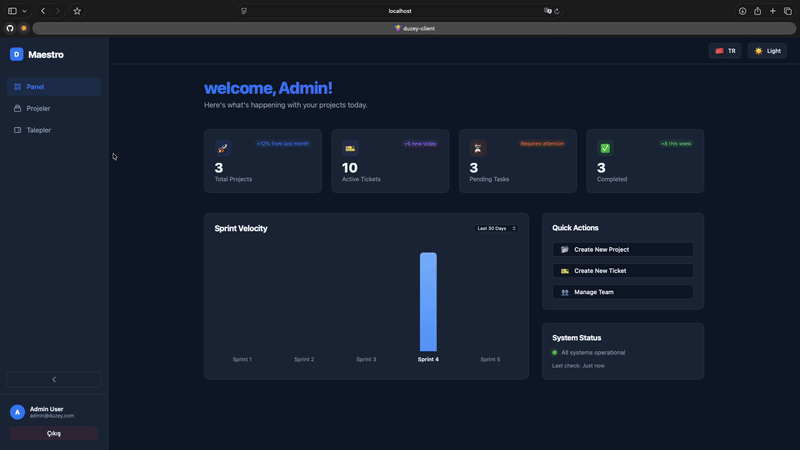

#  Maestro 🚀

**Maestro** is a modern, premium **Agile Project Management** and **Help Desk** solution designed to streamline workflows with style and efficiency. built with .NET 8 and React (Vite).



## ✨ Features

- **🎨 Premium UI/UX**: Glassmorphism design, smooth transitions, and a polished aesthetic using Duzey's corporate identity.
- **🌓 Dark & Light Mode**: Fully supported theming engine with instant toggling.
- **🌍 Localization (i18n)**: Native support for **English** and **Turkish**, extensible for more.
- **📊 Interactive Dashboard**: Real-time overview of projects, tickets, and sprint velocity.
- **🔐 Secure Authentication**: JWT-based auth with modern Login and Register pages.
- **📋 Kanban & Backlog**: Drag-and-drop boards, sprint planning, and backlog management.
- **📱 Responsive**: Collapsible sidebar and flexible layouts for all screen sizes.

## 🛠 Tech Stack

### Server (Backend)
- **.NET 8 Web API**
- **Entity Framework Core** (MSSQL)
- **JWT Authentication**

### Client (Frontend)
- **React 19** + **Vite**
- **Vanilla CSS** (Variables & Semantic Styling)
- **React Router v7**
- **Axios** & **Context API**

## 🚀 Getting Started

### Prerequisites
- .NET 8 SDK
- Node.js (v18+)
- SQL Server (or Docker container)

### 1. Database Setup
```bash
docker-compose up -d
```
*Alternatively, update `ConnectionStrings` in `appsettings.json` to point to your local SQL Server.*

### 2. Backend Setup
```bash
cd Maestro.Server
dotnet restore
dotnet ef database update
dotnet run
```
*Server runs on `http://localhost:5174`*

### 3. Frontend Setup
```bash
cd Maestro.Client
npm install
npm run dev
```
*Client runs on `http://localhost:5173`*

## 📂 Project Structure

```
Maestro/
├── Maestro.Server/       # .NET Core Web API
│   ├── Controllers/
│   ├── Models/
│   └── ...
├── Maestro.Client/       # React + Vite App
│   ├── src/
│   │   ├── components/
│   │   ├── context/
│   │   └── pages/
│   └── ...
└── docker-compose.yml    # SQL Server Config
```

## 🤝 Contributing
1. Fork the repo
2. Create your feature branch (`git checkout -b feature/amazing-feature`)
3. Commit your changes (`git commit -m 'Add amazing feature'`)
4. Push to the branch (`git push origin feature/amazing-feature`)
5. Open a Pull Request